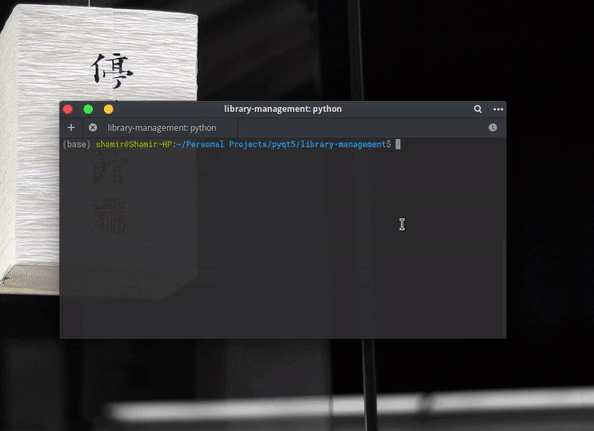

# Library Management Software 📚 <!-- omit in toc -->

    

A software to manage books, customers and users in a library.

## Contents :bookmark_tabs: <!-- omit in toc -->
- [Features](#features)
- [Database Schema](#database-schema)
- [Demo](#demo)
- [Instructions to run](#instructions-to-run)
- [Future Features](#future-features)


### Features

1. Admin Login ☑️
2. Add new books and their attributes to the collection. ☑️
3. Edit and Delete book details. ☑️
4. Add new students or customers to the database. ☑️
5. Edit student/customer details. ☑️
6. Delete Student/customer details. ☑️
7. Change themes. ☑️

### Database Schema

### Demo

The following gif shows the demo of the software.
<div style="text-align:center"></div>


### Instructions to run

1. Setting up mysql client
   
```bash
sudo apt-get install python3-dev default-libmysqlclient-dev build-essential

pip install mysqlclient
```

For installing MySQLdb on linux.  
Reference:
<https://stackoverflow.com/questions/454854/no-module-named-mysqldb/>


1. Run the program.

```bash
  python index.py
```


### Future Features

1. Admin Login into the system.
2. More Security Features like encryption of the passwords,etc.
